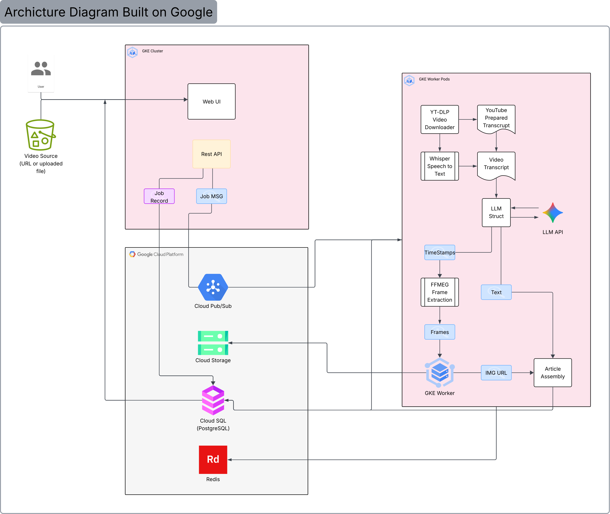

# Video-to-Article as a Service

**Author:** Joel Carlson

---

## Project Goals

This project builds a cloud-hosted service that accepts any video — a YouTube URL, a Zoom recording, or an uploaded file — and returns a structured, illustrated web article. The output resembles a WikiHow or Medium post: titled sections, paragraph or step-by-step text, and screenshots from the video placed contextually alongside the content.

The core problem being solved is one that i experience often: that video is a poor reference format. You cannot skim it, search it, or quickly re-read a specific step. Existing tools (Otter.ai, YouTube captions, Notion AI) produce raw transcripts or bullet summaries — not coherent, illustrated articles. This service bridges that gap.

Target users:
- **Students** who want searchable notes from recorded lectures
- **Professionals** who want structured summaries from Zoom meetings
- **Learners** following tutorial videos who need a readable reference

---

## Software and Hardware Components

All infrastructure is deployed on **Google Cloud Platform (GCP)**.

| Component | Technology | Role |
|---|---|---|
| RPC / API Interface | FastAPI (REST) | Accepts submissions, serves Web UI and article results |
| Web UI | FastAPI + Jinja2 | Submit form, job status page, article display page |
| Message Queue | GCP Pub/Sub | Decouples job submission from async processing |
| Containers | Google Kubernetes Engine (GKE) | Runs all application and worker code |
| Storage Service | Google Cloud Storage (GCS) | Stores uploaded videos and extracted screenshot frames |
| Database | Cloud SQL (PostgreSQL) | Stores job records and generated article HTML |
| Key-Value Store | Redis (GCP Memorystore) | Caches transcripts, tracks in-flight job state |
| Video Download | yt-dlp | Downloads YouTube videos and extracts existing captions |
| Transcription | Whisper (OpenAI) | Transcribes audio when captions are unavailable |
| Frame Extraction | ffmpeg | Extracts frames from video at section timestamps |
| Article Structuring | LLM API (TBD) | Structures transcript into titled sections with timestamps |

**Hardware:** No dedicated hardware. All compute runs on GCP-managed virtual machines within GKE node pools.

---

  
## Architecture Diagram  
      


---  


---

## Component Interactions

The service operates as a three-phase asynchronous pipeline:

---

### Phase 1 — Submission

```
User
 │  submits URL or file
 ▼
Web UI  ──────────────────────────────────────────────────────────
 │  form POST
 ▼
REST API
 ├── creates job record in PostgreSQL       (status: pending)
 ├── writes uploaded file to GCS            (if file upload)
 ├── publishes job message to Pub/Sub
 └── returns job ID to user immediately     (async — no waiting)
```

---

### Phase 2 — Processing  *(GKE Worker)*

```
Pub/Sub
 │  job message consumed
 ▼
┌─────────────────────────────────────────────────────────────────┐
│  Redis cache hit?                                               │
│  YES → skip to LLM Structuring                                  │
│  NO  → continue below                                          │
└─────────────────────────────────────────────────────────────────┘
 │
 ▼
yt-dlp — download video, check for existing captions
 ├── Manual captions found    ──────────────────────┐
 ├── Auto-generated captions found  ────────────────┤
 └── No captions → Whisper transcribes audio        │
                    (word-level timestamps)          │
                                                     ▼
                                             Transcript + timestamps
                                                     │
                                                     ▼
                                             LLM API
                                             returns: section titles
                                                      body text
                                                      section timestamps
                                                     │
                              ┌──────────────────────┤
                              │                      │
                              ▼                      ▼
                           ffmpeg               Article text
                    extract frame per           + structure
                    section timestamp
                              │
                              ▼
                    Blur + stability filter
                    (±3s window, best frame)
                              │
                              ▼
                    Upload frames → GCS
                    return public image URLs
                              │
                              └──────────────────────┐
                                                     ▼
                                             Article Assembly
                                             merge text + image URLs
                                             → final HTML
                                                     │
                                  ┌──────────────────┤
                                  │                  │
                                  ▼                  ▼
                             PostgreSQL           Redis
                          store article        cache transcript
                          mark job complete
```

---

### Phase 3 — Response

```
User (polling /status)
 │
 ▼
REST API reads job status from PostgreSQL
 ├── pending / processing → return progress
 └── complete → redirect to /article
                    │
                    ▼
             Web UI renders article HTML
              tags → browser fetches images directly from GCS
                          (REST API not involved in image serving)
```

---

> **Storage TTL:** GCS objects are deleted automatically via a bucket lifecycle policy after N days. PostgreSQL article records carry a matching `expires_at` field. The API returns a clean expiry page for any article past its TTL.

---

## Debugging and Testing

**Local development:**
Each processing step (ingest, transcription, structuring, frame extraction, assembly) will be implemented as an independently runnable Python module. This allows each stage to be tested in isolation without running the full pipeline.

**Test cases:**
The following videos will be used to validate end-to-end correctness:

| # | Video | Source | Captions | Purpose |
|---|---|---|---|---|
| 1 | [Short tutorial, 2–5 min] | YouTube | Manual | Baseline happy path |
| 2 | [Lecture recording, 30–60 min] | YouTube | Auto-generated | Quality and processing time at scale |
| 3 | [Zoom meeting recording] | File upload | None | File upload path + Whisper fallback |
| 4 | [Poor audio quality video] | YouTube or upload | None | Whisper stress test |

> Specific video URLs will be finalized during development, but the goal is to cover a range of content types, lengths, and caption availability scenarios to ensure robustness across real-world inputs. 

**Definition of success:**
- *Technical:* 90% of submitted test videos produce a complete article without error
- *User-facing:* Average user rating of 4/5 or higher across a minimum of 10 user test sessions

I plan on having classmates and colleagues submit videos from the above categories and rate the output on relevance, readability, and overall quality to validate the user-facing success criteria. It is hard to define a strict quantitative metric for article quality, but user ratings will provide a meaningful signal of whether the output is genuinely useful and well-structured.

**LLM evaluation:** Before finalizing LLM selection, candidate models (e.g. Claude, GPT-4o) will be compared on a sample of test videos using defined criteria: section coherence, factual accuracy relative to transcript, and appropriate screenshot placement. Results will be documented in the final report.

---

## Why This Project Meets the Requirements

This project uses 7 of the 9 required cloud software components:

1. **RPC / API interfaces** — REST API built with FastAPI
2. **Message queues** — GCP Pub/Sub decouples submission from processing
3. **Storage services** — GCS stores videos and frames
4. **Databases** — PostgreSQL on Cloud SQL stores jobs and articles
5. **Key-value stores** — Redis on Memorystore caches transcripts and job state
6. **Containers / functions as a service** — GKE orchestrates all application and worker containers
7. **Message marshalling / encoding** — JSON serialization between all services

Each component is used because it solves a specific architectural problem — the queue handles async processing, the key-value store avoids redundant transcription, the storage service offloads image serving from the application layer. The project is a real service with a working end-to-end pipeline and real users, which also satisfies the GenAI course requirements for the Project/Startup Track.

The scope is realistic: the core pipeline (transcription + LLM structuring + article output) can be built and deployed as an MVP without screenshots or a polished UI, with enhancements added incrementally.

