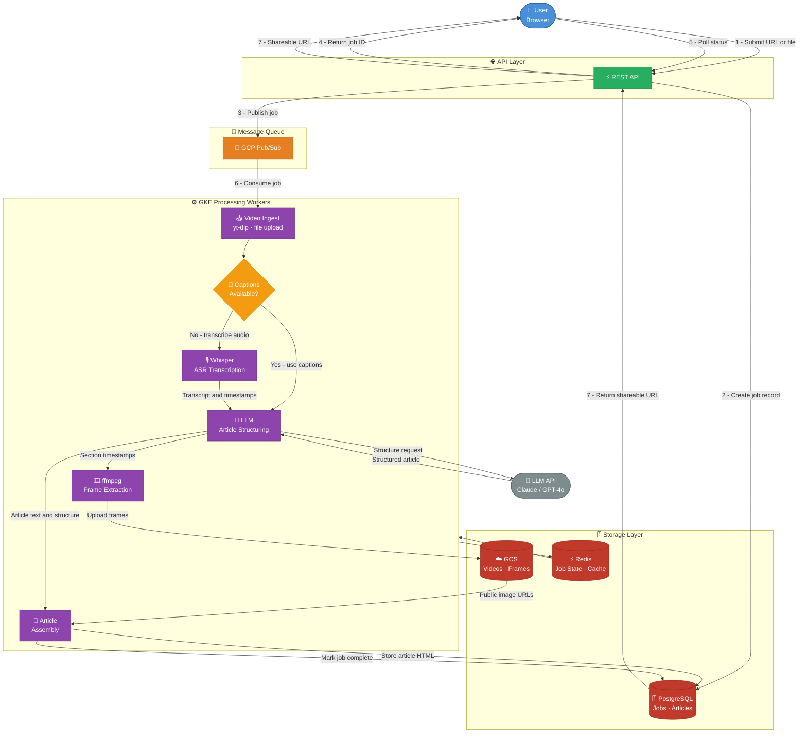

# System Architecture Diagram

## Notes

- **GCS TTL**: Objects deleted automatically via GCS lifecycle policy after N days (set low during testing). PostgreSQL `expires_at` field mirrors this.
- **Caption fallback**: yt-dlp checks for manual captions first, then auto-generated, then falls back to Whisper.
- **Frame extraction timing**: ffmpeg extracts frames at section-start timestamps returned by the LLM structuring step — ensures screenshots align with article content.
- **LLM selection**: TBD after offline comparison of candidate models on sample videos.
